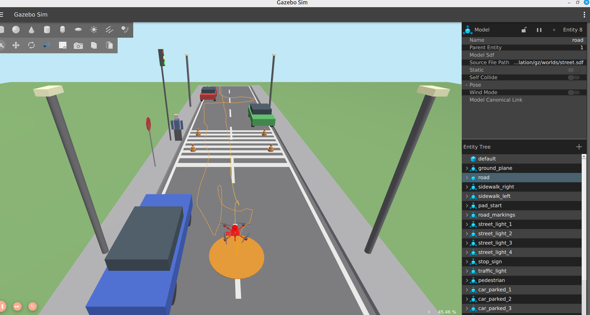
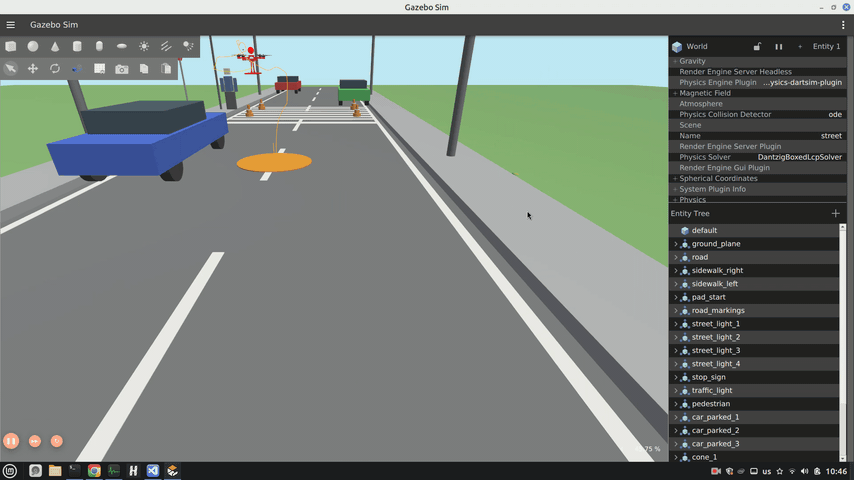

# UAV Digital Twin — автономный квадрокоптер в симуляции

**PX4 SITL + Gazebo Harmonic + Nav2 + компьютерное зрение** — «цифровой двойник»
автономного дрона с бортовым компьютером и RGB-D камерой. Весь стек работает
внутри одного Docker-контейнера (VS Code Dev Container) на базе официального
`PX4/PX4-Autopilot`.

Связь автопилота с ROS2 — через **MicroXRCE-DDS** (топики `/fmu/in`, `/fmu/out`),
**без MAVROS**. Навигация и обход препятствий — **Nav2** (NavfnPlanner + DWB +
Behavior Trees). Обнаружение целей (пешеход, машины, конусы) — **OpenCV + YOLO**
в изолированном .venv .

## Для кого

### 🚁 Вы в комьюнити PX4

Пример того, как выглядит **Nav2 на дроне в 2026 году**:
ROS2 **Jazzy** (последний LTS) + Gazebo **Harmonic** (не Classic) + **micro-XRCE-DDS**
(без MAVROS). Полный оффборд-стек: trajectory_setpoint, MPC, Безье, Behavior Tree,
автоматическая посадка с форсированным disarm. Если вы всё ещё на Foxy + Classic +
MAVROS — вот готовая точка перехода на современный стек.

### 🎮 Вы переходите с Gazebo Classic на Harmonic

Рабочий `ros_gz_bridge` для всех сенсоров (камера RGB, глубина, pointcloud, `/clock`),
кастомные модели машин/пешеходов/знаков, проброс графики из Docker-контейнера на хост.
Никакой магии — только документированные `parameter_bridge` и SDF, которые можно
скопировать в свой проект.

### 🧪 Вы делаете HITL или цифровой двойник

Архитектура намеренно разделена: PX4 общается с ROS2 через стандартные топики
`/fmu/in` и `/fmu/out` — ровно те же, что на реальном полётном контроллере.
Offboard-логика, перцепция и Nav2 переиспользуемы на железе без изменений.
Замените симуляционные ноды (`ros_gz_bridge`, `depth_to_scan`) на драйверы
реальных сенсоров — и та же кодовая база полетит на настоящем дроне.

## Что внутри (скриншоты)


*Квадрокоптер на высоте 3 м, патрулирует улицу с машинами и пешеходом. Nav2 в активном состоянии.*


*Взлёт на 3 м → патруль улицы: облёт car_blue, фонарей, перехода с пешеходом и конусами.*
## Текущее состояние

Полный стек валидирован в мире `street.world`:

- взлёт на **3.0 м**;
- миссия «Патруль улицы» — **28 целей** с обходом препятствий (фонари, светофор,
  знак, машины);
- CV детектирует низкие цели (пешеход / машины / конусы) и публикует их 3D-позицию;
- возврат на точку старта и автоматическая посадка (короткое зависание перед
  `LANDING`, затем автоматический disarm).

## Стек

| Слой | Технология |
|------|------------|
| Симуляция | Gazebo Harmonic (gz-sim 8.x), рендер Mesa/llvmpipe |
| Автопилот | PX4 Autopilot SITL (main / v1.15+) |
| Связь | MicroXRCE-DDS (uORB ↔ ROS2), **без MAVROS** |
| Middleware | ROS2 Jazzy Jalisco |
| Навигация | Nav2 (NavfnPlanner + DWB) + Behavior Trees XML |
| Управление | Offboard Node (Python 3.12): trajectory_setpoint, MPC, Безье |
| Зрение | OpenCV + YOLO (ultralytics) в изолированном venv |
| VIO/SLAM | OctoMap/Voxblox (3D-слой Nav2), ORB-SLAM3/RTAB-Map (опция) |

## Архитектура

```
[ Хост Linux Mint (экран + GTX 1050) ]
       ▲                                  │
       │ проброс графики / X11             │ команды управления
       ▼                                  ▼
┌────────────────── DOCKER КОНТЕЙНЕР ───────────────────┐
│  1. Gazebo Harmonic — рендер мира и физика            │
│         │ (видеопоток, одометрия, физика)             │
│         ▼                                             │
│  2. PX4 SITL — полётный контроллер                    │
│         │ (uORB)                                      │
│         ▼                                             │
│  3. MicroXRCEAgent — мост uORB ↔ ROS2                 │
│         │ (топики /fmu/in, /fmu/out, /camera, ...)    │
│         ▼                                             │
│  4. ROS2-ноды (Python 3.12):                          │
│     - uav_offboard   (MPC/Безье → trajectory_setpoint)│
│     - uav_perception (YOLO / H-маркер → /detections)  │
│     - uav_navigation (Nav2 → /goal_pose, /cmd_vel)    │
│     - uav_sensors    (ros_gz_bridge, depth→scan)      │
└───────────────────────────────────────────────────────┘
```

## Структура репозитория

```
ROS2_Nav2_PX4_Gazebo/
├── .devcontainer/          # VS Code Dev Container (Dockerfile, entrypoint)
├── src/                    # ROS2-рабочее пространство (colcon)
│   ├── px4_msgs/           # копия интерфейсов PX4 (px4_msgs)
│   ├── uav_msgs/           # TargetDetection.msg, MissionGoal.msg
│   ├── uav_bringup/        # sim_full.launch.py (полный запуск стека)
│   ├── uav_gazebo/         # миры (.world) и модели (машины, пешеход, знаки…)
│   ├── uav_sensors/        # ros_gz_bridge, depth→scan, odom/TF
│   ├── uav_offboard/       # offboard_node, nav2_commander, MPC, Безье
│   ├── uav_perception/     # YOLO, H-маркер, target_localizer
│   └── uav_navigation/     # nav2_params.yaml, costmap, behavior_trees
├── scripts/                # launch / build / миссии (навигация по целям)
├── config/px4/             # кастомные airframe / params PX4
├── tools/trajectory_trail/ # gz-плагин отрисовки трека траектории дрона
├── patches/                # локальные патчи PX4 (см. «Установка»)
├── docs/                   # architecture.md, topic_map.md, референс запуска
└── tests/                  # pytest (чистая логика CV/математики, без rclpy)
```

## Железо и рендер

- **Хост:** Linux Mint 22 (Ubuntu 24.04), Intel Core 7-го поколения,
  NVIDIA GTX 1050 Mobile (4 ГБ), 16 ГБ RAM.
- В Docker-контейнере **нет NVIDIA GL** — рендер через Mesa/llvmpipe на
  `DISPLAY=:0`. **Не задавать** `__NV_PRIME_RENDER_OFFLOAD` и другие
  NVIDIA-оверрайды.
- Миры облегчены под слабое железо: тени отключены, физика ODE, `RTF=1.0`,
  камера понижена (RGB 640×360@15 Гц, depth 320×240@20 Гц).

## Установка

```bash
# 1. Клонировать репозиторий
git clone <repo-url> && cd ROS2_Nav2_PX4_Gazebo

# 2. PX4-Autopilot — сторонняя зависимость (в git НЕ хранится)
git clone --recursive https://github.com/PX4/PX4-Autopilot.git PX4-Autopilot
cd PX4-Autopilot
git checkout 99c40407ffd7ac184e2d7b4b293f36f10fe561ef
git -C Tools/simulation/gz checkout d754381a1cecdd7f17050acd72bf5bf1327bced6
cd ..
# Применить локальные патчи (обязательно — см. таблицу ниже):
git -C PX4-Autopilot apply ../patches/px4-autopilot.patch
git -C PX4-Autopilot/Tools/simulation/gz apply ../../patches/px4-gazebo-models.patch
touch PX4-Autopilot/COLCON_IGNORE   # чтобы colcon не собирал PX4 как пакет

# 3. Открыть в Dev Container (VS Code) — окружение соберётся автоматически;
#    либо вручную: bash scripts/build_ws.sh && bash scripts/setup_venv.sh
```

### Сборка образа (самодостаточная)

С версии Dockerfile, описанной ниже, образ **собирает всё сам** — PX4 SITL,
MicroXRCEAgent, ROS2-workspace, venv (CV) и `trajectory_trail` зашиваются в слой
образа на этапе `docker build`. Ручное клонирование PX4 и применение патчей
(шаги 1–2 выше) больше не нужны: их выполняет Dockerfile.

```bash
# 1. Клонировать репозиторий (PX4-Autopilot НЕ нужен — соберётся внутри)
git clone <repo-url> && cd ROS2_Nav2_PX4_Gazebo

# 2. Собрать образ (ДОЛГО: apt + PX4 + агент + colcon + venv + trajectory_trail)
docker build -t uav-dt:jazzy -f .devcontainer/Dockerfile .

# 3. Запустить контейнер (GUI-окно Gazebo выводится на хост :0)
docker run -d --name uav_mission --network host --privileged --gpus all \
  -e DISPLAY=${DISPLAY:-:0} \
  -v /tmp/.X11-unix:/tmp/.X11-unix \
  uav-dt:jazzy sleep infinity

# 4. Дальше — обычный запуск миссии (см. «Запуск миссии» ниже)
```

`patches/` и `.devcontainer/Dockerfile` находятся в git, `.dockerignore`
исключает из build-контекста `PX4-Autopilot/`, `build/`, `install/`, `venv/`
и скомпилированный `trajectory_trail` — всё это генерируется внутри Dockerfile.


### Патчи PX4 (`patches/`)

PX4 и PX4-gazebo-models зафиксированы на конкретных коммитах (см.
`patches/PX4_COMMITS.txt`) и требуют локальных правок:

| Патч | Что меняет | Зачем |
|------|-----------|-------|
| `px4-autopilot.patch` | `UXRCE_DDS_SYNCT 0`, таймаут спавна 1с→10с | workaround скачков времени timesync; GUI-рендер не успевает ответить на `/world/<name>/create` за 1 с |
| `px4-gazebo-models.patch` | понижение разрешения/частоты камеры, увеличение и подсветка дрона | разгрузка GTX 1050; дрон лучше виден в симуляторе |

## Запуск миссии «Патруль улицы»

```bash
# ─── Терминал 1: headless-сервер + PX4 + Nav2 ───
docker exec -it uav_mission bash
source /opt/ros/jazzy/setup.bash
source /workspaces/ROS2_Nav2_PX4_Gazebo/install/setup.bash
bash scripts/launch_sim_headless.sh street.world
# ждать: [lifecycle_manager_navigation]: Managed nodes are active
#        [commander] Takeoff detected

# ─── Терминал 2: окно Gazebo (на хосте :0) ───
docker exec uav_mission bash scripts/launch_gz_gui_x0.sh

# ─── Терминал 3: миссия ───
docker exec uav_mission bash -c 'cd /workspaces/ROS2_Nav2_PX4_Gazebo && bash scripts/run_mission_street.sh --speed 1.0'
```

Остановка (только через контейнер — у хоста нет прав на root-процессы):

```bash
docker exec uav_mission bash scripts/_kill_sim_tmp.sh
```

Другие миры/миссии: `5pillars.world` + `python3 scripts/nav2_mission_5pillars.py --speed 1.5`.

## Ключевые параметры и «грабли» (важно)

- **`/clock` должен быть один** — единственный `ros_gz_bridge`. Дубликат =
  скачки времени = сброс TF = падение Nav2.
- **Timesync**: `UXRCE_DDS_SYNCT=0` (workaround), иначе lockstep → time-jump →
  сброс фильтра и застревание.
- **Nav2** (`nav2_params.yaml`): `default_server_timeout: 20000` (мс),
  `transform_tolerance: 1.0`.
- `min_vel_x/y` **отрицательные** (−0.6) — иначе DWB не едет «на запад».
- Критики поворота отключены (RotateToGoal / GoalAlign / PathAlign).
- VoxelLayer (PointCloud2) отключён — перегружает однопоточный executor.
- QoS `px4_msgs`: **Best Effort + VOLATILE**.
- Камера: `(0.252, 0.03, 0.503)`, RGB HFOV≈69°, depth HFOV≈73°; static TF в
  launch-файле должна совпадать.
- Миры: `<sky>` удалён — на llvmpipe давал тёмное небо.

## Тесты

```bash
# чистая логика CV/математики, без rclpy — можно на хосте
pytest tests/
# внутри контейнера:
docker exec uav_mission bash -lc 'cd /workspaces/ROS2_Nav2_PX4_Gazebo && pytest tests/'
```

## Дорожная карта

1. ✅ Каркас репозитория и Dev Container.
2. ✅ Offboard-управление (`/fmu/in/trajectory_setpoint`).
3. ✅ Компьютерное зрение (YOLO, детекция H-маркера, bbox→3D).
4. ✅ Навигация: depth → `/scan` → Nav2 → обход препятствий.
5. ✅ Миссия «Патруль улицы» (28 целей) — валидирована в полном стеке.
6. ✅ **Автозахват цели** (`target_tracker`: YOLO → Nav2 → удержание). Сейчас CV
   умеет *обнаруживать* цели (пешеход / машины / конусы) и публиковать их
   3D-позицию, а Nav2 умеет ехать по точкам миссии. Пункт — замкнуть их: по
   детекции YOLO автоматически формировать `goal_pose` для Nav2, подлетать к цели
   и удерживаться над ней (hover/tracking). Итог: «увидел цель → сам полетел к
   ней → завис над ней», без заранее прописанных координат миссии.
7. ✅ **Визуальная одометрия** (RGB-D: ORB + `solvePnPRansac`) и **EKF-слияние**
   (VPS vs GPS, метрика дрейфа). Сейчас позиция дрона берётся из PX4/GPS. Пункт —
   оценивать движение по камере: детектировать ORB-фичи, сопоставлять их
   (`solvePnPRansac` восстанавливает позу камеры), затем сливать с GPS через EKF
   (VPS — visual positioning vs GPS) и мерить, насколько накопленный дрейф
   визуальной одометрии расходится с GPS.
8. ⬜ **SLAM + статическая карта** (slam_toolbox + map_server + AMCL). Сейчас Nav2
    работает в режиме «rolling window» (costmap вокруг дрона, без глобальной карты).
    Пункт — запустить slam_toolbox на street.world (async mapping из `/scan` +
    `/odom`), построить occupancy grid всего мира, сохранить как `.pgm` через
    `map_saver_cli`, затем добавить `map_server` + AMCL для повторных полётов по
    готовой карте. Итог: глобальное планирование по всей карте (а не только в окне
    30×30 м) + «красивая карта» в RViz.

## Документация

- `docs/architecture.md` — архитектура и связи пакетов.
- `docs/topic_map.md` — карта топиков ROS2 ↔ PX4.
- `docs/SUCCESSFUL_RUN_REFERENCE.md` — рабочая конфигурация и история правок.

- Alex Flex   email: bus278@gmail.com
-------------------------------------------------------------------------------------------------
- English version

# UAV Digital Twin — an autonomous quadcopter in simulation

**PX4 SITL + Gazebo Harmonic + Nav2 + computer vision** — a "digital twin"
of an autonomous drone with an onboard computer and an RGB-D camera. The entire stack runs
inside a single Docker container (VS Code Dev Container) based on the official
`PX4/PX4-Autopilot`.

Autopilot communication with ROS2 — via **MicroXRCE-DDS** (topics `/fmu/in`, `/fmu/out`),
**without MAVROS**. Navigation and obstacle avoidance — **Nav2** (NavfnPlanner + DWB +
Behavior Trees). Target detection (pedestrians, cars, cones) — **OpenCV + YOLO**
in an isolated venv.

## For whom

### 🚁 You are in the PX4 community

An example of what Nav2 on a drone looks like in 2026:
ROS2 Jazzy (latest LTS) + Gazebo Harmonic (not Classic) + micro-XRCE-DDS (without MAVROS). Full offboard stack: trajectory_setpoint, MPC, Bezier, Behavior Tree,
automatic landing with forced disarm. If you're still using Foxy + Classic + MAVROS, this is a ready-made transition point to a modern stack.

### 🎮 You're switching from Gazebo Classic to Harmonic

A working `ros_gz_bridge` for all sensors (RGB camera, depth, pointcloud, `/clock`),
custom car/pedestrian/sign models, graphics forwarding from a Docker container to the host.
No magic – just documented `parameter_bridge` and SDF, which you can
copy into your project.

### 🧪 You're creating a HITL or digital twin

The architecture is intentionally decoupled: PX4 communicates with ROS2 via the standard topics
`/fmu/in` and `/fmu/out` – exactly the same as on a real flight controller.
Offboard logic, perception, and Nav2 are reusable on the hardware without modification.
Replace the simulation nodes (`ros_gz_bridge`, `depth_to_scan`) with drivers
for real sensors, and the same codebase will run on a real drone.

## What's inside (screenshots)

> ⚠️ Put your PNGs/GIFs in `docs/images/` - they'll be picked up automatically.


*A quadcopter at an altitude of 3 meters patrols a street with cars and a pedestrian. Nav2 is active.*


*3m takeoff → street patrol: flyby of car_blue, streetlights, pedestrian crossing, and traffic cones.*
## Current Status

Full stack validated in the `street.world` world:

- 3.0m takeoff;
- "Street Patrol" mission — 28 targets with obstacle avoidance (streetlights, traffic lights,
sign, cars);
- CV detects low targets (pedestrians / cars / traffic cones) and publishes their 3D positions;
- return to the starting point and automatic landing (short hover before
`LANDING`, then automatic disarm).

## Stack

| Layer | Technology |
|------|------------|
| Simulation | Gazebo Harmonic (gz-sim 8.x), Mesa/llvmpipe renderer |
| Autopilot | PX4 Autopilot SITL (main / v1.15+) |
| Communication | MicroXRCE-DDS (uORB ↔ ROS2), **without MAVROS** |
| Middleware | ROS2 Jazzy Jalisco |
| Navigation | Nav2 (NavfnPlanner + DWB) + Behavior Trees XML |
| Controls | Offboard Node (Python 3.12): trajectory_setpoint, MPC, Bezier |
| Vision | OpenCV + YOLO (ultralytics) in an isolated venv |
| VIO/SLAM | OctoMap/Voxblox (Nav2 3D layer), ORB-SLAM3/RTAB-Map (optional) |

## Architecture

```
[ Linux Mint host (screen + GTX 1050) ]
▲ │
│ graphics passthrough / X11 │ control commands
▼ ▼
┌──────────────────── DOCKER CONTAINER ──────────────────────┐
│ 1. Gazebo Harmonic — world rendering and physics │
│ │ (video stream, odometry, physics) │
│ ▼ │
│ 2. PX4 SITL — Flight Controller │
│ │ (uORB) │
│ ▼ │
│ 3. MicroXRCEAgent — uORB ↔ ROS2 Bridge │
│ │ (Topics /fmu/in, /fmu/out, /camera, ...) │
│ ▼ │
│ 4. ROS2 Nodes (Python 3.12): │
│ - uav_offboard (MPC/Bézier → trajectory_setpoint) │
│ - uav_perception (YOLO / H-marker → /detections) │
│ - uav_navigation (Nav2 → /goal_pose, /cmd_vel) │
│ - uav_sensors (ros_gz_bridge, depth→scan) │
└─────────────────────────── ────────────────────────────┘
```

## Repository Structure

```
ROS2_Nav2_PX4_Gazebo/
├── .devcontainer/ # VS Code Dev Container (Dockerfile, entrypoint)
├── src/ # ROS2 workspace (colcon)
│ ├── px4_msgs/ # copy of PX4 interfaces (px4_msgs)
│ ├── uav_msgs/ # TargetDetection.msg, MissionGoal.msg
│ ├── uav_bringup/ # sim_full.launch.py ​​(full stack launch)
│ ├── uav_gazebo/ # worlds (.world) and models (cars, pedestrians, signs, etc.)
│ ├── uav_sensors/ # ros_gz_bridge, depth→scan, odom/TF
│ ├── uav_offboard/ # offboard_node, nav2_commander, MPC, Bezier
│ ├── uav_perception/ # YOLO, H-marker, target_localizer
│ └── uav_navigation/ # nav2_params.yaml, costmap, behavior_trees
├── scripts/ # launch / build / missions (target navigation)
├── config/px4/ # custom airframes / PX4 params
├── tools/trajectory_trail/ # gz-plugin for rendering the trajectory trail Drone
├── patches/ # local PX4 patches (see "Installation")
├── docs/ # architecture.md, topic_map.md, reference launcher
└── tests/ # pytest (pure CV/math logic, no rclpy)
```

## Hardware and Rendering

- **Host:** Linux Mint 22 (Ubuntu 24.04), 7th generation Intel Core,
NVIDIA GTX 1050 Mobile (4 GB), 16 GB RAM.
- Docker container **no NVIDIA GL** — render via Mesa/llvmpipe on
`DISPLAY=:0`. **Do not set** `__NV_PRIME_RENDER_OFFLOAD` and other
NVIDIA overrides.
- Worlds have been optimized for low-end hardware: shadows disabled, ODE physics, RTF=1.0,
camera reduced (RGB 640×360@15Hz, depth 320×240@20Hz).

## Installation

```bash
# 1. Clone the repository
git clone <repo-url> && cd ROS2_Nav2_PX4_Gazebo

# 2. PX4-Autopilot is a third-party dependency (NOT stored in Git)
git clone --recursive https://github.com/PX4/PX4-Autopilot.git PX4-Autopilot
cd PX4-Autopilot
git checkout 99c40407ffd7ac184e2d7b4b293f36f10fe561ef
git -C Tools/simulation/gz checkout d754381a1cecdd7f17050acd72bf5bf1327bced6
cd ..
# Apply local patches (required - see table below):
git -C PX4-Autopilot apply ../patches/px4-autopilot.patch
git -C PX4-Autopilot/Tools/simulation/gz apply ../../patches/px4-gazebo-models.patch
touch PX4-Autopilot/COLCON_IGNORE # to prevent colcon from building PX4 as a package

# 3. Open in Dev Container (VS Code) - the environment will be built automatically;
# or manually: bash scripts/build_ws.sh && bash scripts/setup_venv.sh
```

### Image building (self-contained)

Starting with the Dockerfile version described below, the image **builds everything itself**—PX4 SITL,
MicroXRCEAgent, ROS2-workspace, venv (CV), and `trajectory_trail` are baked into the image layer
during the `docker build` step. Manually cloning PX4 and applying patches
(steps 1-2 above) is no longer necessary: ​​the Dockerfile handles these tasks.

```bash
# 1. Clone the repository (PX4-Autopilot is NOT needed – it will be built internally)
git clone <repo-url> && cd ROS2_Nav2_PX4_Gazebo

# 2. Build the image (LONG: apt + PX4 + agent + colcon + venv + trajectory_trail)
docker build -t uav-dt:jazzy -f .devcontainer/Dockerfile .

# 3. Run the container (the Gazebo GUI window is displayed on host :0)
docker run -d --name uav_mission --network host --privileged --gpus all \
-e DISPLAY=${DISPLAY:-:0} \
-v /tmp/.X11-unix:/tmp/.X11-unix \
uav-dt:jazzy sleep infinity

# 4. Next, run the mission as usual (see "Running a Mission" below)
```

`patches/` and `.devcontainer/Dockerfile` are in git, `.dockerignore`
excludes `PX4-Autopilot/`, `build/`, `install/`, `venv/`
and the compiled `trajectory_trail` from the build context—all of these are generated inside the Dockerfile.

### PX4 Patches (`patches/`)

PX4 and PX4-gazebo-models are fixed at specific commits (see
`patches/PX4_COMMITS.txt`) and require local edits:

| Patch | What it changes | Why |
|------|----------|-------|
| `px4-autopilot.patch` | `UXRCE_DDS_SYNCT 0`, spawn timeout 1s→10s | workaround for timesync jumps; GUI renderer doesn't respond to `/world/<name>/create` within 1 second |
| `px4-gazebo-models.patch` | lower camera resolution/framerate, zoom in and highlight drone | reduce GTX 1050 load; drone is more visible in the simulator |

## Launching the "Street Patrol" mission

```bash
# ─── Terminal 1: headless server + PX4 + Nav2 ───
docker exec -it uav_mission bash
source /opt/ros/jazzy/setup.bash
source /workspaces/ROS2_Nav2_PX4_Gazebo/install/setup.bash
bash scripts/launch_sim_headless.sh street.world
# wait: [lifecycle_manager_navigation]: Managed nodes are active
# [commander] Takeoff detected

# ─── Terminal 2: Gazebo window (on host :0) ───
docker exec uav_mission bash scripts/launch_gz_gui_x0.sh

# ─── Terminal 3: Mission ───
docker exec uav_mission bash -c 'cd /workspaces/ROS2_Nav2_PX4_Gazebo && bash scripts/run_mission_street.sh --speed 1.0'
```

Stop (only via container - host doesn't have root access to processes):

```bash
docker exec uav_mission bash scripts/_kill_sim_tmp.sh
```

Other worlds/missions: `5pillars.world` + `python3 scripts/nav2_mission_5pillars.py --speed 1.5`.

## Key parameters and pitfalls (important)

- There must be only one /clock parameter — the only one is `ros_gz_bridge`. Duplicate =
Time jumps = TF reset = Nav2 crash.
- Timesync: `UXRCE_DDS_SYNCT=0` (workaround), otherwise lockstep → time-jump →
filter reset and stuck.
- Nav2 (`nav2_params.yaml`): `default_server_timeout: 20000` (ms),
`transform_tolerance: 1.0`.
- `min_vel_x/y` **negative** (−0.6) — otherwise DWB doesn't move west.
- Rotation critics are disabled (RotateToGoal / GoalAlign / PathAlign).
- VoxelLayer (PointCloud2) disabled - overloads single-threaded executor.
- QoS `px4_msgs`: **Best Effort + VOLATILE**.
- Camera: `(0.252, 0.03, 0.503)`, RGB HFOV≈69°, depth HFOV≈73°; static TF in the
launch file must match.
- Worlds: `<sky>` removed - produced a dark sky on llvmpipe.

## Tests

```bash
# pure CV/math logic, without rclpy — can be done on the host
pytest tests/
# inside the container:
docker exec uav_mission bash -lc 'cd /workspaces/ROS2_Nav2_PX4_Gazebo && pytest tests/'
``

## Roadmap

1. ✅ Repository framework and Dev Container.
2. ✅ Offboard management (`/fmu/in/trajectory_setpoint`).
3. ✅ Computer vision (YOLO, H-marker detection, bbox → 3D).
4. ✅ Navigation: depth → `/scan` → Nav2 → obstacle avoidance.
5. ✅ The "Street Patrol" mission (28 targets) has been fully validated.
6. ⬜ **Automatic Target Acquisition** (`target_tracker`: YOLO → Nav2 → hold). Currently, CV
can *detect* targets (pedestrians / cars / cones) and publish their
3D position, and Nav2 can follow mission waypoints. The goal is to close the gap: upon

YOLO detection, automatically generate a `goal_pose` for Nav2, fly to the target

and hover over it. The result: "saw the target → flew to it

it → hovered over it," without pre-programmed mission coordinates.
7. ⬜ **Visual odometry** (RGB-D: ORB + `solvePnPRansac`) and **EKF fusion**
(VPS vs. GPS, drift metric). Currently, the drone's position is taken from PX4/GPS. The goal is to

estimate camera motion: detect ORB features, compare them
(`solvePnPRansac` reconstructs the camera pose), then merge with GPS via EKF

(VPS - visual positioning vs. GPS) and measure how much the accumulated drift

of visual odometry diverges from GPS.
8. ⬜ **SLAM + static map** (slam_toolbox + map_server + AMCL). Currently, Nav2

operates in "rolling window" mode (costmap around the drone, without a global map).
The task is to run slam_toolbox on street.world (async mapping from /scan + /odom), build an occupancy grid for the entire world, save it as a .pgm using
map_saver_cli , then add map_server + AMCL for repeat flights on the
finished map. The result: global planning across the entire map (not just in a 30x30m window) + a "beautiful map" in RViz.

## Documentation

- `docs/architecture.md` — package architecture and relationships.
- `docs/topic_map.md` — ROS2 ↔ PX4 topic map.
- `docs/SUCCESSFUL_RUN_REFERENCE.md` — working configuration and edit history.

- Alex Flex email: bus278@gmail.com
